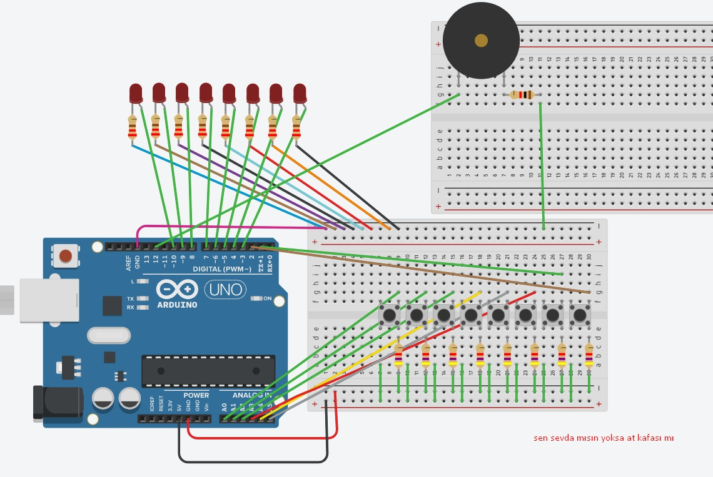
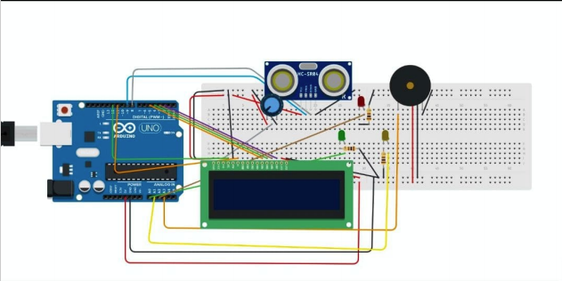
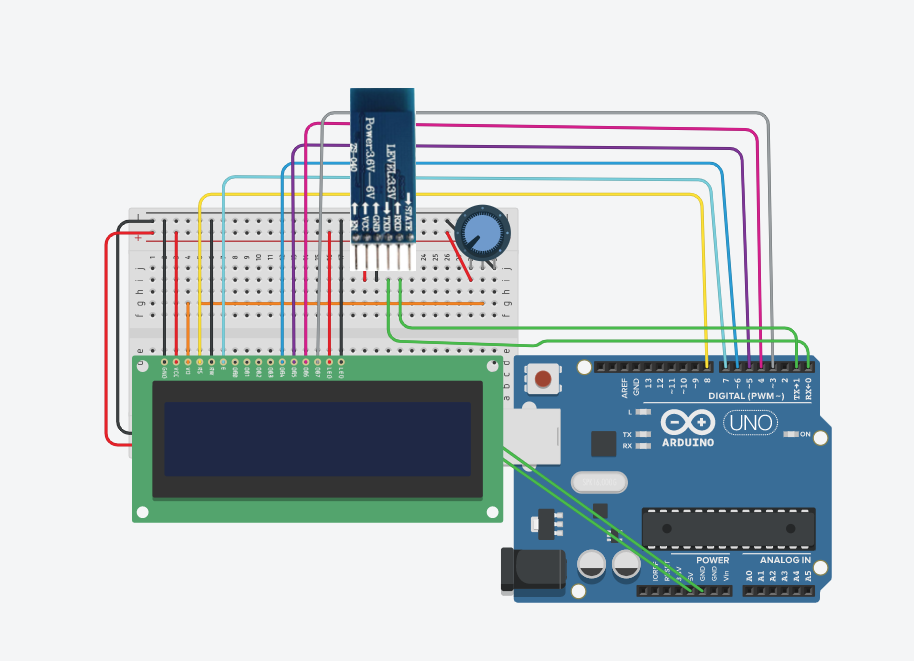
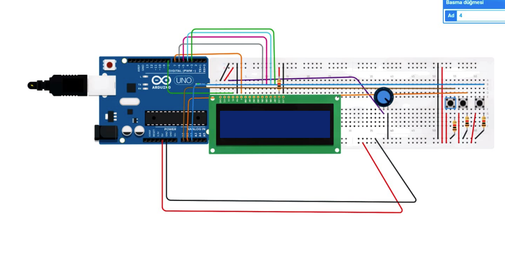
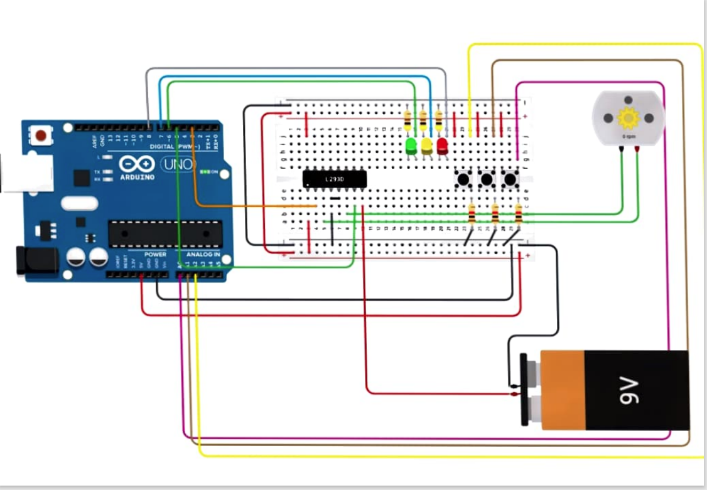

# Arduino

___
####  Led 
___
Ledler üzerine.
Kod ve devre şeması aşağıdaki gibidir.

[Led](https://github.com/alpkaantanis/arduino/ledsketch/ledsketch.ino)

    

___
####  Ultrasonic
___
Ultrasonic sensör üzerine.
Kod ve devre şeması aşağıdaki gibidir.

[Ultrasonic](https://github.com/alpkaantanis/arduino/ultrasonic/ultrasonic.ino)

    

___
####  Bluetooth
___
Bluetooth üzerine.
Kod ve devre şeması aşağıdaki gibidir.

[Bluetooth](https://github.com/alpkaantanis/arduino/bluetooth/bluetooth.ino)

    

___
####  Bluetooth w/ I2C
___
Bluetooth üzerine.
Kod ve devre şeması aşağıdaki gibidir.

[Bluetooth I2C](https://github.com/alpkaantanis/arduino/bluetooth_with_i2c/bluetooth_with_i2c.ino)

___
####  LCD
___
LCD display üzerine.
Kod ve devre şeması aşağıdaki gibidir.

[LCD Display Slide](https://github.com/alpkaantanis/arduino/LCD_display_slide/LCD_display_slide.ino)

    

___
####  Motor
___
Motor üzerine.
Kod ve devre şeması aşağıdaki gibidir.

[LCD Display Slide](https://github.com/alpkaantanis/arduino/motorsketch/motorsketch.ino)

    

